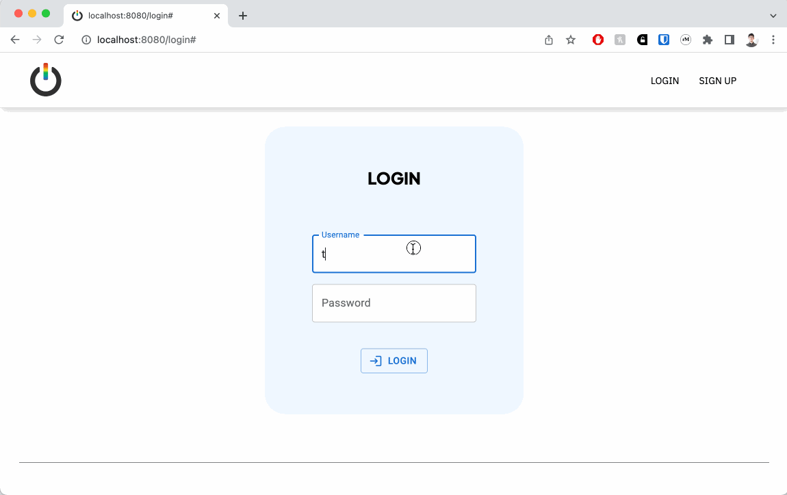

# Out-in-Tech Mentee Application Management System

## ABOUT



This application provides an integrated platform for the Oit-in-Tech mentorship program admissions team to access, read, and score applications from prospective mentees by:

1. Building a database of individual mentee profiles by connecting to Google Forms, pulling mentee applications, and normalizing response data.
2. Displaying individual mentee profiles with mentee information, form responses, and scores/reviews from the Out-in-Tech mentorship program team.
3. Accepting and saving scores and reviews on individual applications from users.
4. Calculating and saving program admissions decisions on individual applications after review criteria has been met.

The application uses the following technologies and frameworks:

- _BACKEND_: PostgreSQL v14.7
- _FRONTEND_: React.js, Redux, Express.js, Node.js

## SETUP

To use this application, you'll need to take the following steps:

- Ensure that your local machine has Node.js and PostgreSQL installed.
- NODE.JS : the Node.js package can be downloaded using Homebrew with `brew install node`. Further instructions for different operating systems and methods can be found at (https://nodejs.dev/en/download/package-manager/).
- POSTGRESQL : on macOS, the PostgreSQL package can be installed using Homebrew with `brew install postgresql@14`. Further instructions can be found at (https://www.postgresql.org/download/)

- Clone this repo onto an empty directory on your local machine with `git clone git@github.com:lateral-neck-stretch/oit-mentorship-db.git`

- Once the repo has been cloned, install the necessary dependencies with `npm install`

- Create two PostgreSQL databases (one for test and one for development) with:

```
createdb oit-mentorship-db
createdb oit-mentorship-db-test
```

## START

### Building the database

- Sync and seed your database by running `npm run seed`.

- Pull application data and build mentee and questions/answers tables by running `npm run formSync`. _Note: this can only be done after you have a valid Google API key saved to a .env file in your project directory._

### Running and using the application

- Run `npm run start:dev` start the server and build client-side files with webpack.

- Open your web browser and navigate to (http://localhost:8080/). For demo purposes, you can log in with any of the following dummy credentials created by the seed script:

  - _Username_: testAcc1 / _Password_: test123

  - _Username_: testAcc2 / _Password_: test123

  - _Username_: testAcc3 / _Password_: test123

  - _Username_: testAcc4 / _Password_: test123
